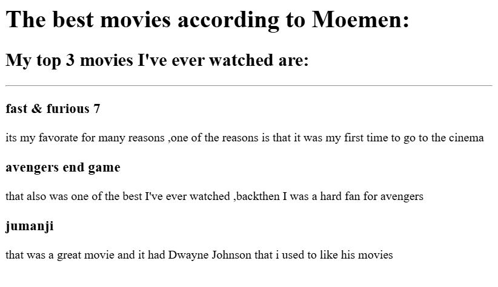

# html-portfolio
simple projects just as a startup
<!DOCTYPE html>
 <html lang="eng">
    <head>
    <meta charset="UTF-8">
    <title> Moemen's Potrfolio</title>
</head>
<body>
    <h1>M.Moemen Ghazzawi's Portfolio</h1>
    <h2> I'm a second year CS student</h2>
    

    <h3><a href="./public/movie-ranking.html">Movie ranking project</a></h3>

<h3><a href="./public/birthday-invite.html">Birthday invite project</a></h3>

<a href="./public/about.html">About Me</a>
<a href="./public/contact.html">Contact Me</a>
</body>
 </html>
